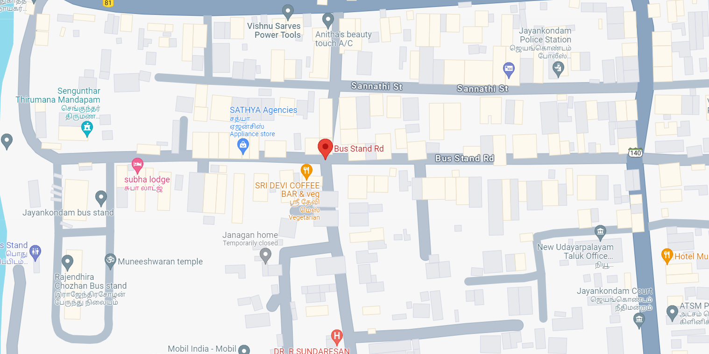
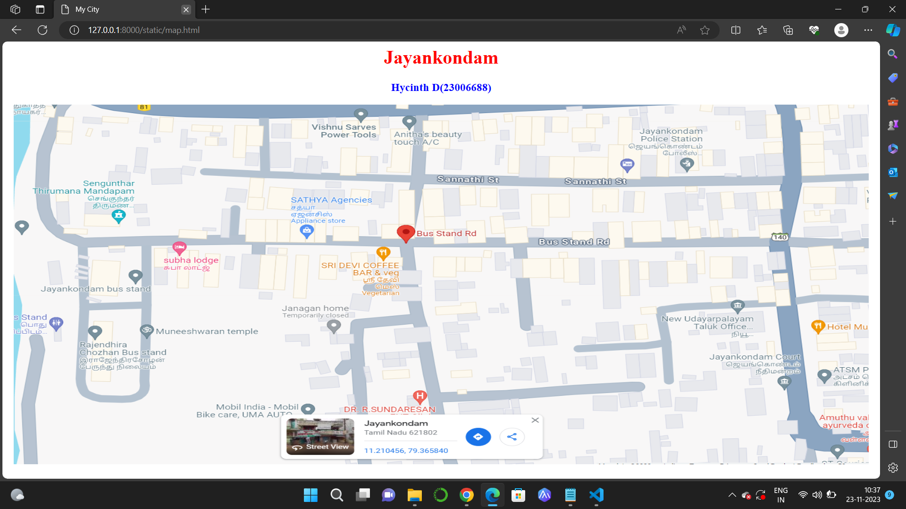
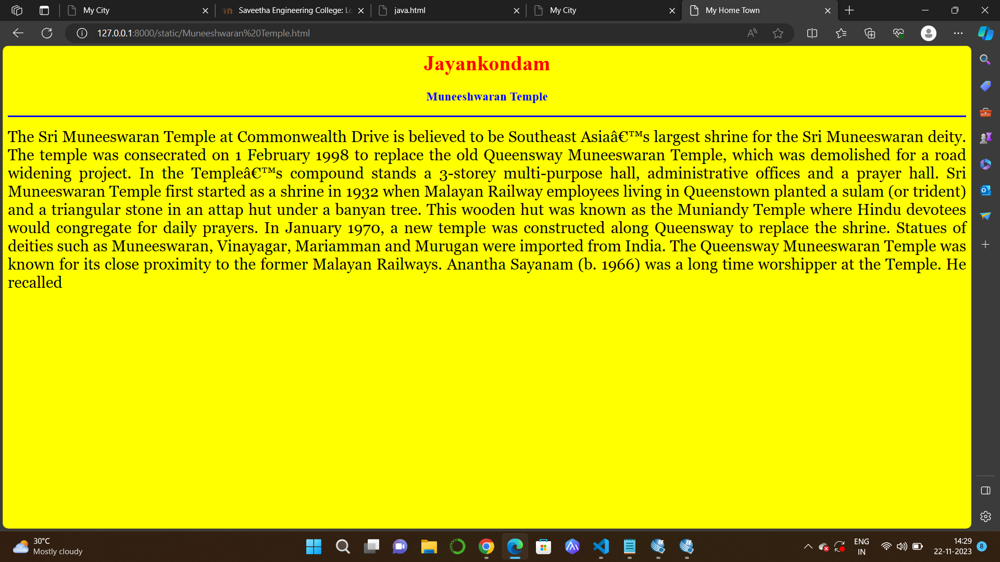
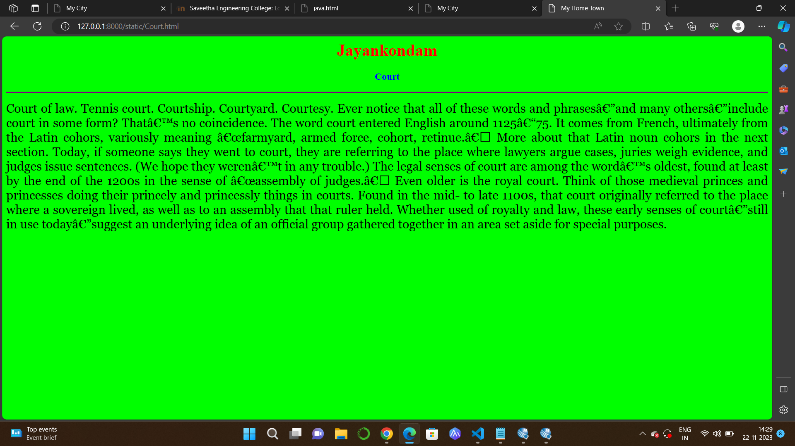
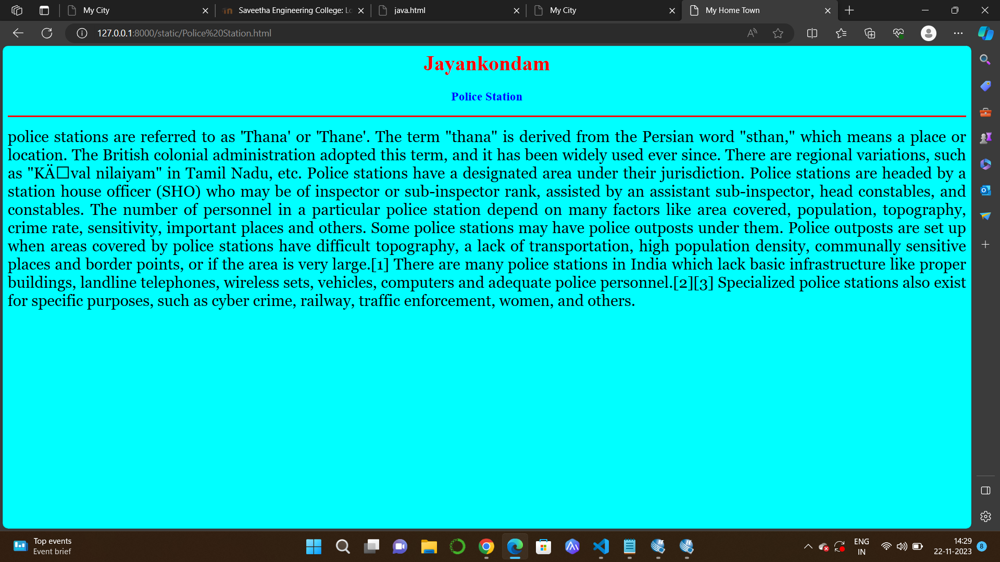

# Ex04 Places Around Me
## Date: 21.11.23

## AIM
To develop a website to display details about the places around my house.

## DESIGN STEPS

### STEP 1
Create a Django admin interface.

### STEP 2
Download your city map from Google.

### STEP 3
Using ```<map>``` tag name the map.

### STEP 4
Create clickable regions in the image using ```<area>``` tag.

### STEP 5
Write HTML programs for all the regions identified.

### STEP 6
Execute the programs and publish them.

## CODE
```
map.html
<html>
    <head>
        <title>My City</title>
    </head>
    <body>
        <h1 align="center">
            <font color="red"><b>Jayankondam</b></font>
        </h1>
        <h3 align="center">
            <font color="blue"><b>Hycinth D(23006688)</b></font>
        </h3>
        <center>
            
            <map name="MyCity">
                <area shape="rect" coords="690,200,750,300" title="Busstand Rd" href="Bus.html" >
                <area shape="circle" coords="245,335,58" title="Muneeshwaran Temple" href="Muneeshwaran Temple.html" >
                <area shape="circle" coords="1130,90,58" title="Police Station" href="Police Station.html" >
                <area shape="circle" coords="1335,451,70" title="Court" href="Court.html" >
                <area shape="circle" coords="723,82,66" title="Anitha's Beauty" href="Anitha's Beauty.html" >
            </map>
        </center>
    </body>
</html>

Muneeshwaran Temple.html
<html>
    <head>
        <title>My Home Town</title>
    </head>
        <body bgcolor="yellow">
            <h1 align="center">
            <font color="red"><b>Jayankondam</b></font>
            </h1>
            <h3 align="center">
            <font color="blue"><b>Muneeshwaran Temple</b></font>      
            </h3>
            <hr size="3" color="blue">
            <p align="justify">
                <font face="Georgia" size="5">
                    The Sri Muneeswaran Temple at Commonwealth Drive is believed to be Southeast Asia’s largest shrine for the Sri Muneeswaran deity. The temple was consecrated on 1 February 1998 to replace the old Queensway Muneeswaran Temple, which was demolished for a road widening project. In the Temple’s compound stands a 3-storey multi-purpose hall, administrative offices and a prayer hall.

                    Sri Muneeswaran Temple first started as a shrine in 1932 when Malayan Railway employees living in Queenstown planted a sulam (or trident) and a triangular stone in an attap hut under a banyan tree. This wooden hut was known as the Muniandy Temple where Hindu devotees would congregate for daily prayers. In January 1970, a new temple was constructed along Queensway to replace the shrine. Statues of deities such as Muneeswaran, Vinayagar, Mariamman and Murugan were imported from India.
                    
                    The Queensway Muneeswaran Temple was known for its close proximity to the former Malayan Railways. Anantha Sayanam (b. 1966) was a long time worshipper at the Temple. He recalled
                </font>
            </p>
    </body>
</html>

bus.html
<html>
    <head>
        <title>My Home Town</title>
    </head>
        <body bgcolor="cyan">
            <h1 align="center">
            <font color="red"><b>Jayankondam</b></font>
            </h1>
            <h3 align="center">
            <font color="blue"><b>Busstand Rd</b></font>      
            </h3>
            <hr size="3" color="red">
            <p align="justify">
                <font face="Georgia" size="5">
                    A bus stand, also called a bus bay, or bus stance, is a designated parking location where a bus or coach waits out of service between scheduled public transport services. 'Bus stand' is also often an alternative name for specific bus stops inside a bus station.[1]

Bus stands are seen at different busy spots, like school or college gates, markets, medical centres and the crossing point(s) of two or more roads. A bus stand is usually employed to allow a bus to lay over at a bus terminus, without giving the appearance of being in service, or blocking the stop from use by other buses that are in service. Bus stands also allow short-term parking for driver changes or driver breaks.

In the simplest case, a bus turnout type of bus stop is extended, and buses can lay over away from the stop if necessary. In locations where buses cannot remain stationary for long, nearby but separate bus stands may be provided where other bus parking is not conveniently located.

                </font>
            </p>
    </body>
</html>

Police Station.html
<html>
    <head>
        <title>My Home Town</title>
    </head>
        <body bgcolor="cyan">
            <h1 align="center">
            <font color="red"><b>Jayankondam</b></font>
            </h1>
            <h3 align="center">
            <font color="blue"><b>Police Station</b></font>      
            </h3>
            <hr size="3" color="red">
            <p align="justify">
                <font face="Georgia" size="5">
                    police stations are referred to as 'Thana' or 'Thane'. The term "thana" is derived from the Persian word "sthan," which means a place or location. The British colonial administration adopted this term, and it has been widely used ever since. There are regional variations, such as "Kāval nilaiyam" in Tamil Nadu, etc. Police stations have a designated area under their jurisdiction. Police stations are headed by a station house officer (SHO) who may be of inspector or sub-inspector rank, assisted by an assistant sub-inspector, head constables, and constables. The number of personnel in a particular police station depend on many factors like area covered, population, topography, crime rate, sensitivity, important places and others. Some police stations may have police outposts under them. Police outposts are set up when areas covered by police stations have difficult topography, a lack of transportation, high population density, communally sensitive places and border points, or if the area is very large.[1] There are many police stations in India which lack basic infrastructure like proper buildings, landline telephones, wireless sets, vehicles, computers and adequate police personnel.[2][3] Specialized police stations also exist for specific purposes, such as cyber crime, railway, traffic enforcement, women, and others.
                </font>
            </p>
    </body>
</html>

Anitha's Beauty.html
<html>
    <head>
        <title>My Home Town</title>
    </head>
        <body bgcolor="yellow">
            <h1 align="center">
            <font color="red"><b>Jayankondam</b></font>
            </h1>
            <h3 align="center">
            <font color="blue"><b>Anitha's Beauty</b></font>      
            </h3>
            <hr size="3" color="red">
            <p align="justify">
                <font face="Georgia" size="5">
                    Our committed and competent team is here to help keep your hair, nails, skin, and body healthy and beautiful. In addition to our regular beauty services such as pedicures, manicures, and hair services we will continue to perfect our skills and keep educated on all the latest styles. Enjoy our wide range of services in a cozy and luxurious environment. We look forward to serving you!

                </font>
            </p>
    </body>
</html>

court.html
<html>
    <head>
        <title>My Home Town</title>
    </head>
        <body bgcolor="lime">
            <h1 align="center">
            <font color="red"><b>Jayankondam</b></font>
            </h1>
            <h3 align="center">
            <font color="blue"><b>Court</b></font>      
            </h3>
            <hr size="3" color="purple">
            <p align="justify">
                <font face="Georgia" size="5">
                    Court of law. Tennis court. Courtship. Courtyard. Courtesy. Ever notice that all of these words and phrases—and many others—include court in some form? That’s no coincidence.

                    The word court entered English around 1125–75. It comes from French, ultimately from the Latin cohors, variously meaning “farmyard, armed force, cohort, retinue.” More about that Latin noun cohors in the next section.
                    
                    Today, if someone says they went to court, they are referring to the place where lawyers argue cases, juries weigh evidence, and judges issue sentences. (We hope they weren’t in any trouble.) The legal senses of court are among the word’s oldest, found at least by the end of the 1200s in the sense of “assembly of judges.”
                    
                    Even older is the royal court. Think of those medieval princes and princesses doing their princely and princessly things in courts. Found in the mid- to late 1100s, that court originally referred to the place where a sovereign lived, as well as to an assembly that that ruler held.
                    
                    Whether used of royalty and law, these early senses of court—still in use today—suggest an underlying idea of an official group gathered together in an area set aside for special purposes.
                </font>
            </p>
    </body>
</html>
```

## OUTPUT







## RESULT
The program for implementing image maps using HTML is executed successfully.
